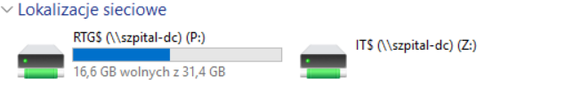
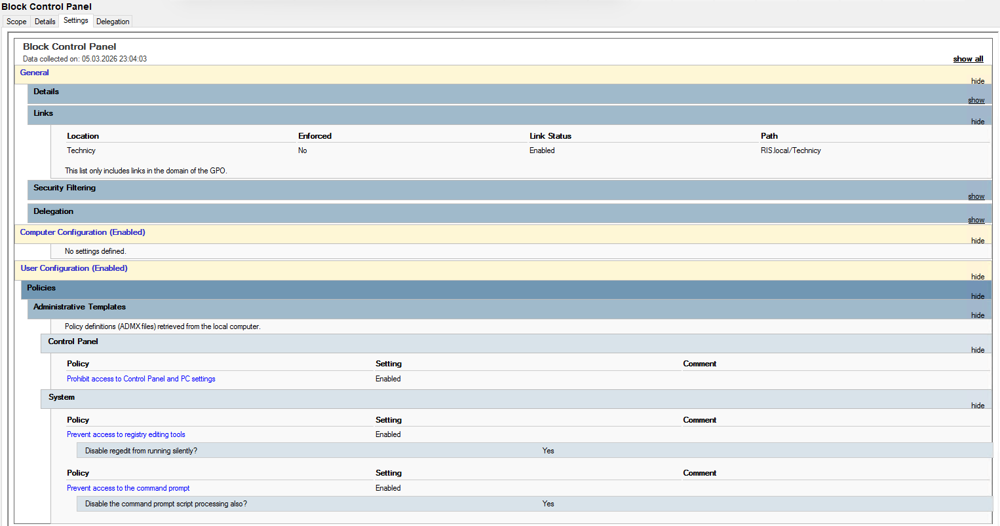

# Active Directory - Laboratorium
Windows serwer oraz Active Direcotory to nieodłączne elementy architektury IT w szpitalu oraz większości firm. Znajomość teoretyczna oraz praktyczna jest kluczowa dla każdego SysAdmina. 
W celu przyswojenia wiedzy z zakresu tworzenia i administracji Architektury IT z wykorzystaniem AD utworzono laboratorium symulacyjne, prezentujący zakład diagnostyki obrazowej. \

## Architektura środowiska
### VM1 – Domain Controller
- Windows Server 2019
- rola: Active Directory Domain Controller
- domena: RIS.local

### VM2 – Client
- Windows 11
- komputer dołączony do domeny

## Domena 
Utworzono domene reprezentującą ZDO: `RIS.local`

## Jednotka organizacyjna
Jednostka organizacyjna (ang. Organizational Unit – OU) jest to kontener w domenie służący do segregacji obiektów, w tym przypadku userów.
Ze względu na laboratoryjny charakter oraz niską złożoność domenu utworzono jedną jednostkę nazwaną `Technicy`. 
Została następnie wykorzystana do tworzenia rozbudowanej polityki bezpieczeństwa utworzonej dla elektroradiologów korzystających z komputerów w domenie. 

## Grupy Dostępu oraz utworzone udziały SMB
Zgodnie z politykami bezpieczestwa danych każda grupa pracowników, w tym każdy użytkownik z osobna powinien męć przypisaną rolę oraz politykę co `może widzieć, a czego nie może widzieć`.
W celu zrealizowania tej myśli utworzono grupy dostępu, gdzie każdy użytkownik jest przypisany do jednej z dwóch:
- IT
- Technicy

W zależności od podane grupy posiada dostęp do odpowiednich folderów za pomocą udziałów utworzonych z poziomu kontrolera domeny. Zgodnie z tymi grupami dostępu użytkownik należący do danej grupy posiada lub nie do danego udziału (przypomina to działanie linuxowej SMB, gdzie dostęp do udziału definiowany członkostwem w grupie smb do której należy udział).
Zgodnie z powyższymi regułami utworzono dwa udziały
- IT$
- RTG$

Poniższy obraz przedstawia widok dla użytkownika, który ma dostęp jedynie do `RTG$`. Mimo, że widzi drugi udział nie może do niego wejść.

## Utworzeni użytkownicy
Każdy dostęp do komputera oraz jego zasobów musi być możliwy w przypadku posiadania odpowiedniego konta. Bez niego dostęp nie jest możliwy.
W tym celu utworzono następujących użytkowników:
Administratorzy, którzy zostali również wpisani do grupy administratorów domeny:

Konto technika należąca do jednostki organizacyjnej `technik` z przydzielonymi do tej grupy dostępami oraz politykami:

## Polityki bezpieczeństwa
Nieodłącznym elementem prawidłowego zarządzania domeną jest efektywne zarządzanie bezpieczeństwem, a co za tym idzie politykami bezpieczeństwa i dostępu. 
Zgodnie z nimi regularny pracownik nie powinien mieć dostępu do wielu poufnych informacji, a możliwość modyfikacji działania systemu powinna być również ograniczona.
- zablokowany dostęp do ustawień oraz panelu sterowania - regularny pracownik nie może dokonywać zmian konfiguracyjnych na komputerach oraz sprawdzanie informacji o sprzęcie
- zablokoany dostęp do rejestrów - regedit posiada szczegółowe informacje o działaniu aplikacji, dostęp do nich może spowodować uszkodzenie ich działania
- zablokowany dostęp do CMD - jest to dodatkowa blokada przeciwko bardziej doświadcoznych użytkowników, blokująca możliwość tworzenia i uruchamiania nieporządanych skryptów.
  
Wygląd utworzonych polityk dostępów pzedstawia poniższa ilustacja

## IIS - hostowanie strony za pomocą Web Serwera
Windows Server udostępnia możliwość hostowania stron webowych. W przypadku tego laboratorium i powiązania jego z całym homelabem wykorzystan go do hostowania prostej strony startowej z listą aplikacji wykorzystywanych przez regularnych pracownik ZDO. 
Szablon strony hostowany na serwerze przedstawia poniższa ilustracja:

