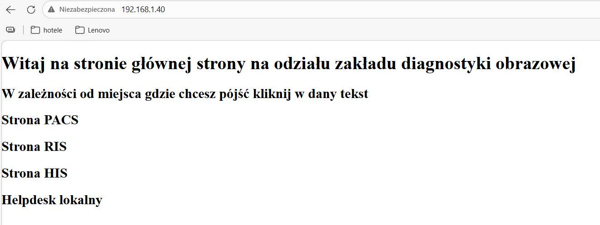

# Active Directory - Laboratorium
Windows serwer oraz Active Direcotory to nieodłączne elementy architektury IT w szpitalu oraz większości firm. Znajomość teoretyczna oraz praktyczna jest kluczowa dla każdego SysAdmina. 
W celu przyswojenia wiedzy z zakresu tworzenia i administracji Architektury IT z wykorzystaniem AD utworzono laboratorium symulacyjne, prezentujący zakład diagnostyki obrazowej. \

## Architektura środowiska
### VM1 – Domain Controller
- Windows Server 2019
- rola: Active Directory Domain Controller
- domena: RIS.local

### VM2 – Client
- Windows 11
- komputer dołączony do domeny

## Domena 
Utworzono domene reprezentującą ZDO: `RIS.local`

## Jednotka organizacyjna 
- Technicy
- IT

## Grupy Dostępu
- IT
- Technicy

## Udziały SMB
- IT$ - tylko IT
- RTG$ - tylko technicy

## Utworzeni użytkownicy
Administratorzy:

Konto technika należąca do UO Technika:

## Polityki bezpieczeństwa

## IIS - hostowanie strony za pomocą Web Serwera
