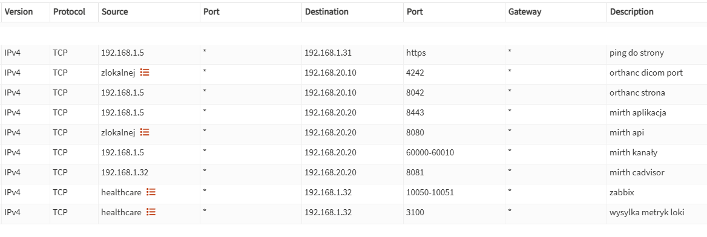
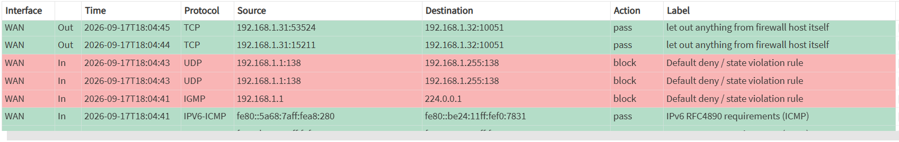

# Laboratorium - zarządzaniem ruchem sieciowym przy obecności rozwiązaniami UTM

## Cel laboratorium

Laboratorium służy do nauki:

- bezpieczeństwa sieci,
- segmentacji usług medycznych,
- firewallingu,
- monitorowania ruchu,
- bezpieczeństwa DICOM / HL7,
- hardeningu RIS/PACS/Mirth,
- detekcji anomalii i późniejszej integracji z SIEM.

---

## Sieć Healthcare

### LAN

```text
Network: 192.168.20.0/24
```

W tej sieci obecnie znajdują się:

```text
192.168.20.10  Orthanc
192.168.20.20  Mirth
```

Docelowo zostanie również umieszczony:

```text
Serwer FHIR / HIS
```

### Docelowy model

```text
                    OPNsense
                       |
        +--------------+--------------+
        |              |              |
       FHIR          Mirth         Orthanc
```

---

## Cel bezpieczeństwa
Celem bezpieczeństwa jest ograniczenie ruchu wchodzącego i wychodzącego do infrastruktury aplikacji medycznych. Aplikacje te nie powinny mieć dostępu na zewnątrz do internetu. Dostęp do nich powinny mieć jedynie tylko wytyczone komputery, a ruch na portach powinien być puszczony jedynie na portach potrzebnych do prawidłowej pracy aplikacji oraz możliwości ich monitorowania.

---

## Charakterystyka środowiska
### Wykorzystane adresy:
W celu realizacji podstawowych zadań laboratium wykorzystano następuję elementy:
```text
Głównego routera - 192.168.1.1
Komputer administratora - 192.168.1.5
Monitoring - 192.168.1.32
OPNSense - 192.168.1.31
Orthanc - 192.168.20.10
Mirth - 192.168.20.20
```

### Aliasy
Podczas tworzenia reguł zdarzało się puszczać ruch na porcie dla więcej niż jednej VM lub LXC bez puszczania ruchui dla całych podsieci. Do tego zostały wykorzytane aliasy. W formie zaimplementowanej są do obejrzenia [po klinięciu tutaj](kody/OPNSense/aliases.json).
Utworzono dwa aliasy:
- **healthcare** - reprezentuje LXC aplikacji medycznych znajdujących się w sieci LAN (192.168.20.0/24) 
- **zlokalnej** - 192.168.1.5 oraz 192.168.1.32 (komputer admina oraz VM monitoringu)

### NAT
Do prawidłowej komunikacji z podsiecią 192.168.20.0/24 utworzono regułę [NAT-ową](kody/OPNSense/nat.csv).

## Wykorzystane reguły
Zestaw wszystkich reguł jest dostępny [po kliknięciu tutaj](kody/OPNSense/rules.csv)
Poniższy zrzut ekranu prezentuje część zaimplementowanych reguł.

### Dostęp do GUI OPNSense
Dostęp do GUI jest puszczony jedynie dla komputera admina.

### Orthanc

`zlokalnej` posiada puszczony ruch na porty:
- dicom port (4242)
- GUI i API (8042)
`monitoring` posiada również otwarty ruch dla portów:
- pobieranie metryk Zabbixowych (10050)
- cadvisor (8081)

### Mirth
`zlokalnej` posiada puszczony ruch na port od api Mirth (8080).
`administrator` posiada puszczony ruch dla portów
- aplikacji desktopowej (8443)
- kanały (60000-60010)
`monitoring` posiada również otwarty ruch dla portów:
- pobieranie metryk Zabbixowych (10050)
- cadvisor (8081)

### Puszczony ruch z LAN do WAN
Tak jak zostało wspomniane wyżej ruch z LAN do WAN jest ograniczony do jedynie portów niezbędnych do działania aplikacji oraz obsługi ich.
Został puszczony ruch do `monitoringu` na portach:
- agenci zabbixowi (10050,10051)
- Loki (3100)

## Monitoring ruchu
Stosując się zasady:
**Najpierw obserwuj → potem ograniczaj → następnie wykrywaj → na końcu reaguj.**
Nie odłącznym elementem jest analiza ruchu w trybie live. OPNSense posiada idealne narzędzie przedstawione na poniższym zrzucie.

LiveView pozwala w czasie rzeczywistym przeanalizować aktualny ruch sieciowy, a w trakcie tworzenia infrastruktury jakie porty oraz jaki ruch można zablokować lub odblokować.

## Następne etapy laboratorium
- wdrożenie LXC FHIR do sieci LAN (inprogress)
- wdrożenie aplikacji PseudoRIS do sieci LAN (inprogress)
- indywidualny serwer nginx z reverse proxy
- utworzenie osobnej sieci LAN dla komputerów Personelu oraz VM managmentowych
