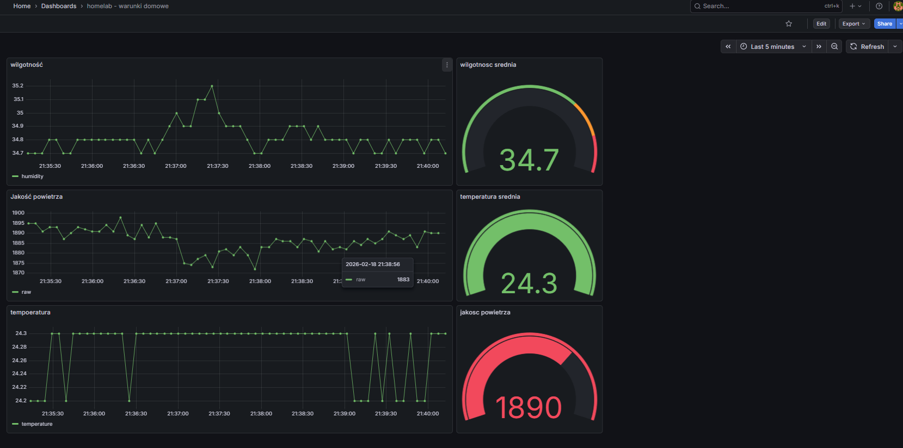

# Laboratorium z dziedziny IoT (Internet Rzeczy)
Nie odłacznym elemementem rozwoju informatyki jest współpraca elektorniki (a dokładniej mikrokontrolerów) z systemami informatycznymi. 
## Przetwornik analogowo-cyfrowy
Rozbudowane układy elektroniczne pozwalają pobierać najważniejsze dane nt. otoczenia. Ważnym krokiem jest ADC, czyli przetwarzanie danych analogowych na dane cyfrowe. 
Zjawiska naturalne czyli zmiana temperatury lub wilgotnosci na podstawie zmian napięciowych konwertowany jest na sygnał elektryczny. 
## Czujnik domowy
W celu przyswojenia wiedzy z działania IOT utworzono układ elektorniczny z czujnikiem wilgotności oraz temperatury, który przesyła dane do serwera lokalnego. Na podstawie tych danych geneerowane są odpowiednie wykresy. 
### Układ elektroniczny
- ESP32 (z modułem wifi)
- DHT22
- płytka stykowe
- kabelki
```
TO DO: pokazać układ elektroniczny
```

### Typy komunikacji
ESP posiada wbudowany moduł wifi, który z wykorzystaniem odpowiednich bibliotek w arduino ide oraz bibliotek można wysyłać dane wybranym protokołem. 
#### MQTT
MQTT to protokół do przesyłania danych metodą `pub-sub`. Działa w oparciu o centralny broker, który odbiera komunikaty od wydawców (publishers) i przekazuje je subskrybentom (subscribers) zainteresowanym konkretnym tematem (topic). 
W tej częsci projektu wykorzystano serwer Mosquito jako broker. Następnie telegraf jako subksrybent odbiera komunikaty i przesyła do bazy typu Infuxdb. 
#### Bezpośrednie
Jednym z dużych ułatwień influxdb jest użycie bezpośredniego połączenia między ESP32, a Influxdb. Influxdb udostępnia bibliotekę w arduino ide do wysyłania danych za pomocą HTTP. Influxdb posiada rozbudowane GUI z możliwością generowania kodu dla esp32 do łączenia się z wybranym bucketem oraz wysyłaniem danych. Rozwiązanie to pozwala omijać tworzenie kontenerów z dodatkowymi aplikacjami do przekierowywania kolejki z danymi. 
### Grafana
Wszsytkie dane przesyłane do `Influxdb` są prezentowane w czasie rzeczywistym w specjalnie przygotowanym dashboardzie, widocznym poniżej.

